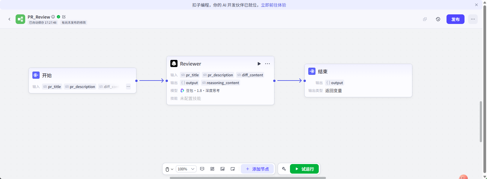
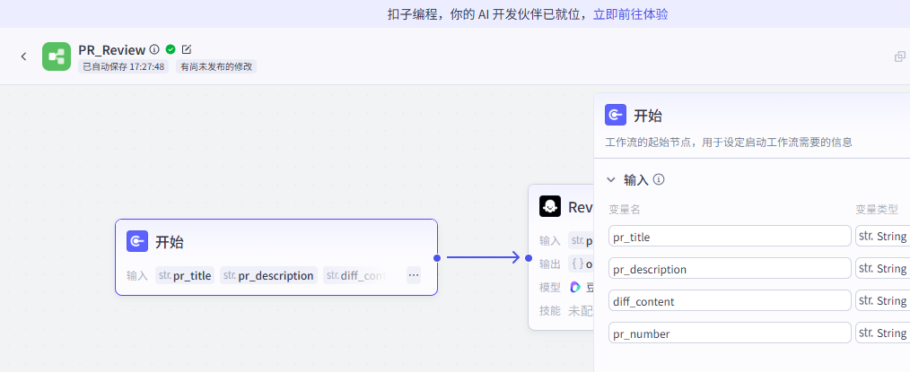
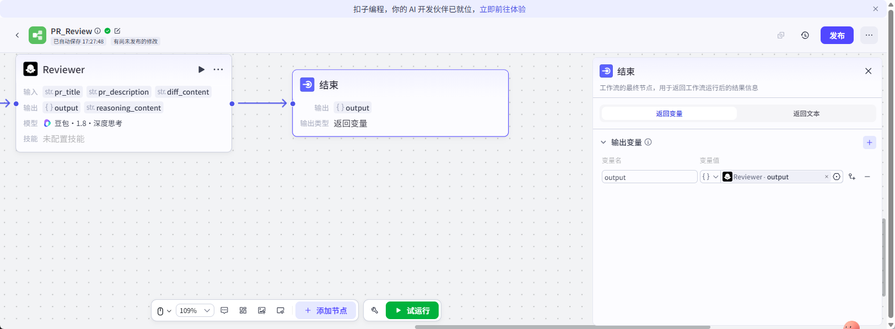
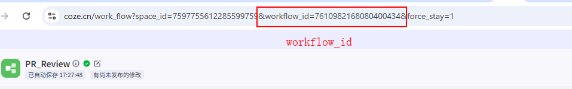
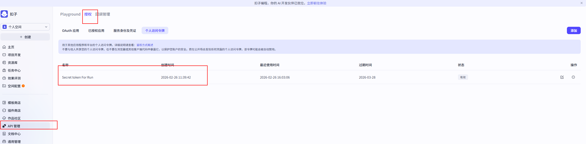
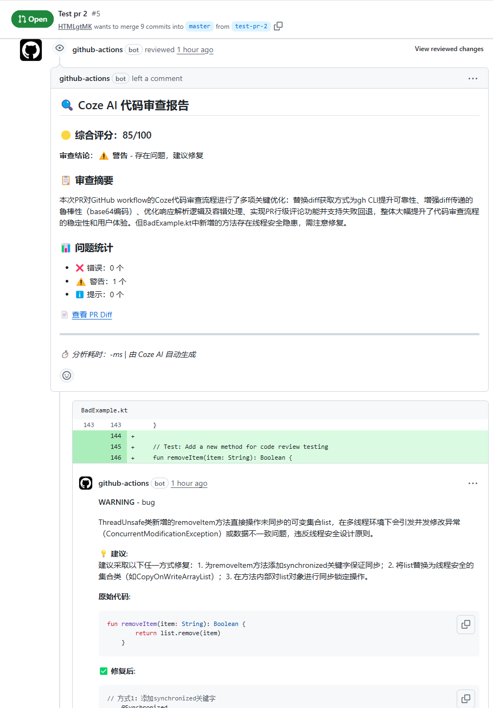
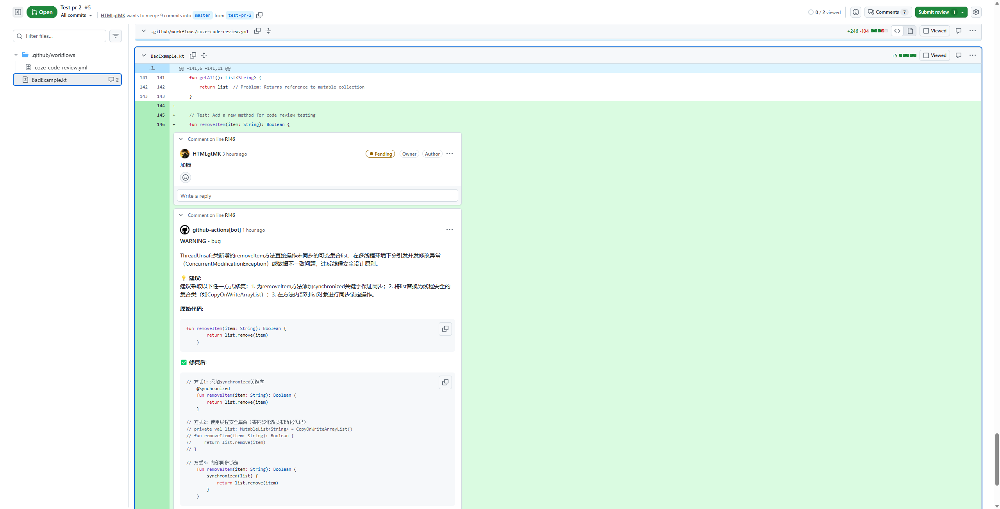

# Coze 平台完整指南

Idea：
1. 自动化代码审查：提 MR -> Github Actions -> 自动审查 -> 发布审查结果。
2. 自动化生成固定风格的小红书post：自动热点收集 -> AI文案生成 -> AI封面生成 -> 通知用户/自动发布。


## 一、Coze 平台是什么

**Coze** 是一个 AI 应用开发平台，只需一句话，即可一站式完成从构建到落地的完整生产级闭环。

比如：
| 交付形态 | 开发方式 | 部署输出 |
|----------|----------|----------|
| Web 应用 | 自然语言驱动 | 火山引擎一键部署 |
| 移动应用 | 自然语言构建 | 可执行 APK 包 |
| 智能接口 | 自然语言/可视编排 | 智能体、工作流 API |


提供的最重要的两大核心能力：

### 核心概念

| 能力 | 说明 |
|------|------|
| **Workflow（工作流）** | 可视化编排的自动化任务流程，将多个 AI 能力和工具按预定义顺序执行 |
| **Agent（智能体）** | 基于大语言模型的智能助手，能够理解用户意图并自主决策调用工具 |

### Coze AI编程的技术特点

低代码、可视化开发；云端（沙箱）环境；一键发布/部署。

---

## 二、Coze 核心组件详解


> 以下介绍 Coze 平台中的八大核心组件：插件、工作流、知识库、卡片、提示词、数据库、音色、记忆库，以及它们的应用场景和实现能力。

---

### 一、全局速览

| 组件 | 核心定位 | 典型用例 |
|------|----------|----------|
| **插件** ✅ | 连接外部世界和特殊能力的入口 | 调用Google搜索、发邮件、访问股票API、执行复杂计算 |
| **工作流** ✅ | 结构化编排复杂任务和步骤 | 多步骤审批流程、数据清洗→分析→生成报告的链路 |
| **知识库** | 让模型"阅读"并记住你的资料 | 产品手册、公司制度、行业白皮书等文档问答 |
| **卡片** | 结构化信息在对话中的呈现 | 订单卡片、商品卡片、任务清单、表单填写 |
| **提示词** | 控制模型行为和输出格式 | 角色设定、风格约束、输出模板、思维链引导 |
| **数据库** | 持久化存储和读写数据 | 用户记录、订单信息、任务状态、计数器 |
| **音色** | 语音输出的声音选择 | 客服女声、播客男声、儿童语音等 |
| **记忆库** | 上下文持久化和跨会话记忆 | 用户偏好、历史对话摘要、长期习惯 |

<details>
<summary> 组件描述 </summary>


---

### 二、插件（Plugin）

#### 核心能力

插件是 Coze 连接外部系统的**接口层**，本质是对外部 API/服务的封装。插件让 Bot 能突破模型本身的能力边界。

#### 具体功能

- **调用外部 API**：连接搜索引擎、地图服务、天气 API、金融数据源
- **访问企业系统**：集成 CRM、ERP、OA 等内部业务系统
- **执行专业操作**：PDF 解析、Excel 处理、图像生成、数据分析
- **复杂计算**：科学计算、统计分析、加密解密

#### 适用场景

| 场景类型 | 具体案例 |
|----------|----------|
| **实时数据获取** | 查询汇率、股价、天气、航班信息 |
| **外部服务调用** | 发送邮件、创建日历事件、发送短信 |
| **专业能力扩展** | 合同审核、财务报表分析、图像识别 |
| **业务系统集成** | 从 CRM 读取客户信息、向 ERP 提交订单 |

---

### 三、工作流（Workflow）

#### 核心能力

工作流是**可视化编排的任务链**，将复杂操作拆解为多个步骤，支持条件判断、循环、变量传递。

#### 具体功能

- **多步骤编排**：将复杂任务分解为顺序执行的步骤
- **条件分支**：根据判断结果执行不同路径
- **循环处理**：对列表数据进行批量处理
- **变量传递**：在步骤间传递和处理数据
- **错误处理**：捕获和处理执行过程中的异常
- **并行执行**：多个步骤同时运行提高效率

#### 适用场景

| 场景类型 | 具体案例 |
|----------|----------|
| **业务流程自动化** | 订单处理（接收→验证→库存检查→支付→发货） |
| **审批流程** | 请假审批、报销审批、项目立项审批 |
| **数据处理管道** | 爬取→清洗→存储→分析→可视化 |
| **内容生产流水线** | 素材收集→写作→审核→发布→归档 |
| **智能客服路由** | 意图识别→分类→转人工→记录反馈 |

---

### 四、知识库（Knowledge Base）

#### 核心能力

知识库是**模型的外挂大脑**，上传文档后模型可以检索、理解并基于文档内容回答问题。

#### 具体功能

- **文档上传**：支持 PDF、Word、Markdown、TXT 等多种格式
- **语义检索**：基于语义理解找到相关文档片段
- **精准问答**：基于文档内容提供准确答案
- **来源引用**：标注答案来源，方便追溯验证
- **批量更新**：支持知识的批量导入和更新

#### 适用场景

| 场景类型 | 具体案例 |
|----------|----------|
| **企业知识问答** | 员工手册、产品 FAQ、技术文档、政策制度 |
| **专业领域咨询** | 法律条文、医疗指南、行业标准、学术资料 |
| **学习助手** | 课程资料、论文笔记、教材辅导、考试大纲 |
| **产品支持** | 产品说明书、故障排查指南、最佳实践 |

---

### 五、卡片（Card）

#### 核心能力

卡片是**结构化信息的呈现载体**，让对话输出更直观、可交互。

#### 具体功能

- **富文本展示**：支持标题、正文、图片、链接等元素
- **交互按钮**：提供快捷操作入口
- **表单输入**：收集用户结构化信息
- **进度展示**：显示任务进度、加载状态
- **模块化组合**：多个卡片组合展示复杂信息

#### 适用场景

| 场景类型 | 具体案例 |
|----------|----------|
| **信息卡片** | 商品详情、订单状态、个人信息、活动海报 |
| **操作入口** | 快捷按钮、功能菜单、跳转链接 |
| **任务清单** | 待办事项、步骤指引、检查清单 |
| **表单收集** | 报名表单、反馈问卷、信息登记 |
| **结果展示** | 搜索结果、推荐列表、排行榜 |

---

### 六、提示词（Prompt）

#### 核心能力

提示词是**模型行为的控制中枢**，通过精心设计的指令引导模型输出符合预期的内容。

#### 具体功能

- **角色设定**：定义模型的身份和专业背景
- **语气风格**：控制输出的正式度、幽默度、亲和力
- **格式约束**：指定输出格式（JSON、代码、Markdown、表格）
- **思维引导**：使用 Chain-of-Thought 等技巧引导推理过程
- **输出模板**：定义输出的结构和必填字段
- **行为约束**：设置模型的回答边界和禁止事项

#### 适用场景

| 场景类型 | 具体案例 |
|----------|----------|
| **角色扮演** | 面试官、翻译、写作助手、心理咨询师 |
| **格式化输出** | 生成 API 调用、SQL 语句、代码片段 |
| **风格控制** | 正式公文、营销文案、技术文档、社交媒体 |
| **复杂推理** | 数学解题、逻辑推理、案例分析 |
| **内容生成** | 文章写作、摘要生成、创意脑暴 |

---

### 七、数据库（Database）

#### 核心能力

数据库是**Bot 的记忆中枢**，实现数据的持久化存储和读写。

#### 具体功能

- **数据存储**：保存结构化数据（文本、数字、日期等）
- **CRUD 操作**：创建、读取、更新、删除数据
- **查询过滤**：根据条件检索数据
- **关联查询**：支持多表关联和复杂查询
- **事务处理**：保证数据操作的原子性

#### 适用场景

| 场景类型 | 具体案例 |
|----------|----------|
| **用户记录** | 积分、等级、偏好设置、历史记录 |
| **业务数据** | 订单、任务、日志、库存 |
| **状态管理** | 对话进度、步骤标记、审批状态 |
| **计数统计** | 访问量、转化率、使用频次 |
| **配置存储** | 系统参数、规则配置、字典数据 |

---

### 八、音色（Voice）

#### 核心能力

音色是**语音输出的声音风格选择**，用于生成不同风格的语音内容。

#### 具体功能

- **声音选择**：不同性别、年龄、地域的声音
- **情感表达**：喜怒哀乐等情感状态
- **语速调节**：适应不同场景的播放速度
- **多语言支持**：中文、英文等多种语言

#### 适用场景

| 场景类型 | 具体案例 |
|----------|----------|
| **语音助手** | 客服、导航、播报、提醒 |
| **内容创作** | 播客、有声书、广告、配音 |
| **情感化交互** | 儿童故事、陪伴对话、心理辅导 |
| **无障碍服务** | 视障辅助、老年人关怀 |

---

### 九、记忆库（Memory）

#### 核心能力

记忆库是**跨会话的长期记忆容器**，让 Bot 能记住关键信息并在后续对话中调用。

#### 具体功能

- **长期存储**：保存跨会话的关键信息
- **上下文延续**：新对话可访问历史记忆
- **智能提取**：自动从对话中提取关键信息
- **记忆更新**：根据新的对话内容更新记忆
- **记忆遗忘**：支持过时记忆的清理

#### 适用场景

| 场景类型 | 具体案例 |
|----------|----------|
| **个性化服务** | 记住用户喜好、习惯、禁忌 |
| **长期交互** | 学习辅导、心理咨询、健身陪伴 |
| **上下文连贯** | 多轮对话的状态保持、话题承接 |
| **关系维护** | 客户关系管理、会员运营 |

---


### 十、组件组合指南

#### 典型组合模式

| 组合方案 | 实现能力 | 适用场景 |
|----------|----------|----------|
| 知识库 + 数据库 | 专业问答系统 | 企业客服、产品支持、技术咨询 |
| 工作流 + 插件 + 数据库 | 业务自动化 | 订单处理、审批流程、数据同步 |
| 提示词 + 音色 | 个性化语音助手 | 智能客服、语音导航、内容朗读 |
| 卡片 + 数据库 | 交互式信息管理 | 任务看板、数据看板、表单系统 |
| 知识库 + 工作流 + 提示词 | 智能文档处理 | 合同审核、简历筛选、报告生成 |
| 记忆库 + 数据库 + 提示词 | 长期个性化服务 | 学习助手、健康管家、财务顾问 |

---

</details>

## 三、Workflow 如何提供给外部使用

基于 `workflow_craft.md` 方案，以**自动化代码审查系统**为例，详细介绍 Workflow 对外提供的完整流程。

地址：https://www.coze.cn/work_flow?space_id=7597755612285599759&workflow_id=7610982168080400434&force_stay=1


### 3.1 整体架构

```
┌─────────────┐     ┌──────────────┐     ┌─────────────┐
│  开发者提交  │ ──→ │ GitHub Actions│ ──→ │  Coze API   │
│    PR 代码   │     │  获取 PR 信息  │     │  Workflow   │
└─────────────┘     └──────────────┘     └─────────────┘
                                              │
┌─────────────┐     ┌──────────────┐     ←────┘
│  审查评论    │ ←── │  解析结果并   │
│  发布到 PR   │     │  构建 Markdown │
└─────────────┘     └──────────────┘
```

---

### 步骤 1：创建 Coze Workflow



#### 1.1 配置输入参数



在 Workflow 设置中定义输入变量：

| 参数名 | 类型 | 说明 |
|--------|------|------|
| `pr_title` | string | PR 标题 |
| `pr_description` | string | PR 描述 |
| `diff_content` | string | 代码变更内容（diff） |
| `commit_messages` | array | 提交信息列表 |

#### 1.2 设计工作流节点


**注：以下 craft 中的，实际只用了一个 llm 节点。**

```
代码输入 → 代码分析 → 规则检查 → 建议生成 → 输出格式化
              ↓           ↓           ↓           ↓
         （LLM 节点）（代码节点）（LLM 节点）（结束节点）
```


**节点说明：**

| 节点 | 功能 | 配置要点 |
|------|------|----------|
| 代码分析节点 | 解析 diff，识别变更的文件和代码逻辑 | 使用 LLM 节点，提示词指导分析维度 |
| 规则检查节点 | 检查代码规范、潜在 bug、安全问题 | 使用代码节点执行检查脚本 |
| 建议生成节点 | 生成具体的修改建议和优化方案 | 使用 LLM 节点，基于问题生成建议 |
| 输出格式化节点 | 输出结构化 JSON 结果 | 使用 Code 节点构造 JSON 对象 |

#### 1.3 输出节点



直接取了 llm 节点的输出作为最后输出。


#### 1.5 获取 API 访问凭证

- 在 Workflow 设置中启用 **API 访问**
- 获取 `Workflow ID` 和 `API Token`
- 获取授权凭证: https://www.coze.cn/open/oauth/pats
- 记录 API 端点地址：`https://api.coze.cn/v1/workflow/run`

---




#### 1.6 调试 Workflow

https://www.coze.cn/open/playground/workflow_run


### 步骤 2：配置 GitHub Actions

<details>
<summary>Github Actions Workflow</summary>
#### 2.1 创建工作流文件

在项目根目录创建 `.github/workflows/coze-code-review.yml`：

```yaml
name: Coze Code Review

on:
  pull_request:
    types: [opened, synchronize, reopened]

jobs:
  coze-review:
    runs-on: ubuntu-latest
    permissions:
      contents: read
      pull-requests: write

    steps:
      - name: Checkout code
        uses: actions/checkout@v4
        with:
          fetch-depth: 0

      - name: Get PR Info
        id: pr-info
        run: |
          echo "title=${{ github.event.pull_request.title }}" >> $GITHUB_OUTPUT
          echo "body=${{ github.event.pull_request.body }}" >> $GITHUB_OUTPUT
          DIFF=$(curl -s -H "Authorization: token ${{ secrets.GITHUB_TOKEN }}" \
            -H "Accept: application/vnd.github.v3.diff" \
            "${{ github.event.pull_request.diff_url }}" | head -c 50000)
          echo "diff<<EOF" >> $GITHUB_OUTPUT
          echo "$DIFF" >> $GITHUB_OUTPUT
          echo "EOF" >> $GITHUB_OUTPUT

      - name: Call Coze API
        id: coze
        run: |
          JSON_PAYLOAD=$(jq -n \
            --arg workflow_id "${{ secrets.COZE_WORKFLOW_ID }}" \
            --arg title "${{ steps.pr-info.outputs.title }}" \
            --arg body "${{ steps.pr-info.outputs.body }}" \
            --arg diff "${{ steps.pr-info.outputs.diff }}" \
            --arg pr_number "${{ github.event.number }}" \
            '{
              workflow_id: $workflow_id,
              parameters: {
                pr_title: $title,
                pr_description: $body,
                diff_content: $diff,
                pr_number: $pr_number
              }
            }')

          RESPONSE=$(curl -s -X POST "https://api.coze.cn/v1/workflow/run" \
            -H "Authorization: Bearer ${{ secrets.COZE_API_TOKEN }}" \
            -H "Content-Type: application/json" \
            -d "$JSON_PAYLOAD")

          REVIEW_DATA=$(echo "$RESPONSE" | jq -r '.data' 2>/dev/null || echo "$RESPONSE")
          echo "result<<COZE_EOF" >> $GITHUB_OUTPUT
          echo "$REVIEW_DATA" >> $GITHUB_OUTPUT
          echo "COZE_EOF" >> $GITHUB_OUTPUT

      - name: Post Review Comment
        uses: actions/github-script@v7
        with:
          github-token: ${{ secrets.GITHUB_TOKEN }}
          script: |
            const reviewResult = ${{ steps.coze.outputs.result }};

            // 构建 Markdown 评论
            let body = `## 🔍 Coze AI 代码审查报告\n\n`;
            const score = reviewResult.score || 0;
            const scoreEmoji = score >= 90 ? '🟢' : score >= 70 ? '🟡' : '🔴';
            body += `### ${scoreEmoji} 综合评分：${score}/100\n\n`;

            const conclusion = reviewResult.conclusion || 'warning';
            const conclusionBadge = {
              'pass': '✅ **通过** - 代码质量良好，可以合并',
              'fail': '❌ **失败** - 存在严重问题，必须修复',
              'warning': '⚠️ **警告** - 存在问题，建议修复'
            }[conclusion];
            body += `**审查结论**：${conclusionBadge}\n\n`;

            if (reviewResult.summary) {
              body += `### 📋 审查摘要\n${reviewResult.summary}\n\n`;
            }

            const stats = reviewResult.statistics || {};
            body += `### 📊 问题统计\n`;
            body += `- ❌ 错误：${stats.error_count || 0} 个\n`;
            body += `- ⚠️ 警告：${stats.warning_count || 0} 个\n`;
            body += `- ℹ️ 提示：${stats.info_count || 0} 个\n\n`;

            // 详细问题列表（按文件分组）
            if (reviewResult.issues.length > 0) {
              body += `### 📝 详细问题\n\n`;
              const grouped = reviewResult.issues.reduce((acc, issue) => {
                const file = issue.file || '未知文件';
                if (!acc[file]) acc[file] = [];
                acc[file].push(issue);
                return acc;
              }, {});

              for (const [file, issues] of Object.entries(grouped)) {
                body += `<details>\n<summary><b>${file}</b> (${issues.length} 个问题)</summary>\n\n`;
                issues.forEach(issue => {
                  const severityEmoji = {
                    'error': '❌',
                    'warning': '⚠️',
                    'info': 'ℹ️'
                  }[issue.severity] || '•';
                  const lineInfo = issue.line ? `:${issue.line}${issue.end_line ? `-${issue.end_line}` : ''}` : '';
                  body += `${severityEmoji} **${issue.category || '通用'}** \`${file}${lineInfo}\`\n\n`;
                  body += `> ${issue.message}\n\n`;
                  if (issue.suggestion) {
                    body += `**💡 建议**：${issue.suggestion}\n\n`;
                  }
                  body += '---\n\n';
                });
                body += '</details>\n\n';
              }
            }

            body += `\n---\n*由 Coze AI 自动生成*`;

            // 查找并更新/创建评论
            const { data: comments } = await github.rest.issues.listComments({
              owner: context.repo.owner,
              repo: context.repo.repo,
              issue_number: context.issue.number
            });

            const botComment = comments.find(c =>
              c.user.type === 'Bot' &&
              c.body.includes('Coze AI 代码审查报告')
            );

            if (botComment) {
              await github.rest.issues.updateComment({
                owner: context.repo.owner,
                repo: context.repo.repo,
                comment_id: botComment.id,
                body: body
              });
            } else {
              await github.rest.issues.createComment({
                owner: context.repo.owner,
                repo: context.repo.repo,
                issue_number: context.issue.number,
                body: body
              });
            }

      - name: Check Conclusion
        if: ${{ steps.process.outputs.conclusion == 'fail' }}
        run: |
          echo "::error::代码审查未通过，存在严重问题"
          exit 1
```

#### 2.2 调用 Coze API 详解

```bash
# 构造请求体
JSON_PAYLOAD=$(jq -n \
  --arg workflow_id "YOUR_WORKFLOW_ID" \
  --arg title "PR 标题" \
  --arg body "PR 描述" \
  --arg diff "代码 diff 内容" \
  --arg pr_number "123" \
  '{
    workflow_id: $workflow_id,
    parameters: {
      pr_title: $title,
      pr_description: $body,
      diff_content: $diff,
      pr_number: $pr_number
    }
  }')

# 调用 API
curl -s -X POST "https://api.coze.cn/v1/workflow/run" \
  -H "Authorization: Bearer YOUR_API_TOKEN" \
  -H "Content-Type: application/json" \
  -d "$JSON_PAYLOAD"
```

**请求参数说明：**

| 参数 | 说明 |
|------|------|
| `workflow_id` | Workflow 唯一标识 |
| `parameters` | 工作流输入参数对象 |
| `parameters.pr_title` | PR 标题 |
| `parameters.pr_description` | PR 描述 |
| `parameters.diff_content` | 代码变更内容 |

**响应结构：**

```json
{
  "code": 0,
  "msg": "success",
  "data": {
    "review_result": {
      "version": "1.0",
      "summary": "...",
      "score": 85,
      "issues": [...]
    }
  }
}
```

---

### 步骤 3：配置 GitHub Secrets

在仓库 **Settings → Secrets and variables → Actions** 中添加：

| Secret 名称 | 说明 |
|-------------|------|
| `COZE_API_TOKEN` | Coze API 访问令牌 |
| `COZE_WORKFLOW_ID` | Workflow ID |

---


</details>
---

### 步骤 5：效果预览

当开发者提交 [PR](https://github.com/HTMLgtMK/CRPipeline/pull/5) 后，会自动收到类似这样的评论：



---

```
## 🔍 Coze AI 代码审查报告

### 🟡 综合评分：78/100

**审查结论**：⚠️ **警告** - 存在问题，建议修复

### 📋 审查摘要

本次提交引入了 2 个潜在错误和 3 个警告，建议修复后再合并。

### 📊 问题统计

- ❌ 错误：2 个
- ⚠️ 警告：3 个
- ℹ️ 提示：5 个

### 📝 详细问题

<details>
<summary><b>src/utils/auth.js</b> (2 个问题)</summary>

❌ **security** `src/utils/auth.js:45`

> 存在 SQL 注入风险，用户输入未经验证直接拼接到 SQL 语句
</details>
**💡 建议**：使用参数化查询或 ORM 的预编译语句

---

*由 Coze AI 自动生成*
```

对应 issue 的文件行也展示 comment：


---


---

### 关键要点总结

| 环节 | 注意事项 |
|------|----------|
| **Workflow 设计** | 输出必须是结构化 JSON，便于外部解析 |
| **API 调用** | 使用 Bearer Token 认证，Content-Type 为 application/json |
| **错误处理** | GitHub Actions 中需处理 API 超时、失败等情况 |
| **结果解析** | 使用 `jq` 等工具解析 JSON，提取关键字段 |
| **安全配置** | API Token 等敏感信息必须存入 Secrets |
| **输出规范** | 确保 `issues` 数组和必要字段存在，便于评论构建 |

---


### 4.4 故障排查

如果工作流运行失败，检查：

1. Coze API Token 是否有效且未过期
2. 工作流 ID 是否正确
3. 代码 diff 是否过大（建议限制在 500 行以内）
4. 查看 Actions 日志中的详细错误信息

---

</details>

#### 4.5 展望
1. gitlab 平台的接入自动化PR。
2. 优化提示词，接入内部知识库等。
3. 接入 IM 工具通知状态。
4. 其他。


## 五、总结

Coze 平台通过 **Workflow** 和 **Agent** 两大核心能力，结合**插件、知识库、卡片、提示词、数据库、音色、记忆库**等组件，为 AI 应用开发提供了完整的基础设施。

| 特性 | Workflow | Agent |
|------|----------|-------|
| 适用场景 | 固定流程、自动化任务 | 对话交互、自主决策 |
| 执行方式 | 预定义节点顺序执行 | 动态规划、工具调用 |
| 可控性 | 高（流程固定） | 中（AI 自主决策） |
| 开发难度 | 低（可视化编排） | 中（提示词工程） |

两者可结合使用：Agent 作为用户交互入口，复杂任务交由 Workflow 执行，实现灵活性与可控性的平衡。

通过 API 开放能力，Coze Workflow 可以轻松集成到外部系统（如 GitHub Actions、CI/CD 流程、企业应用等），实现 AI 能力的无缝对接。
